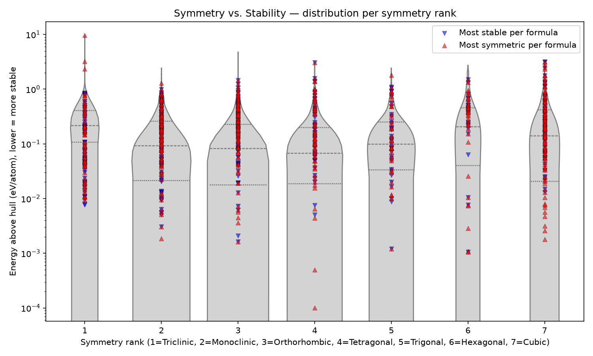
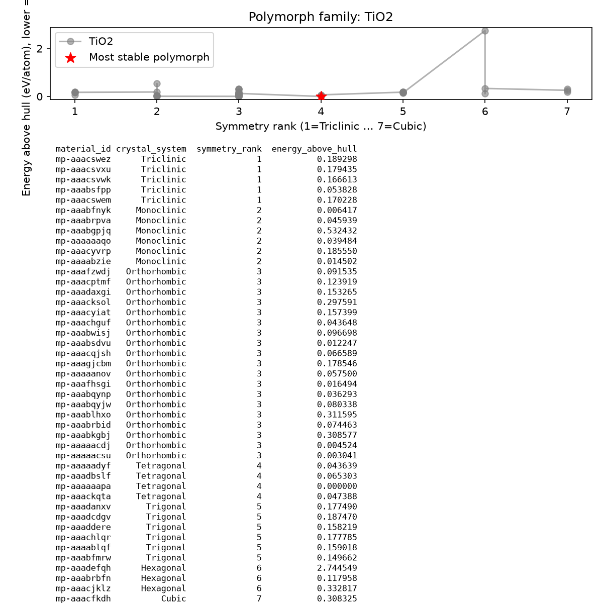
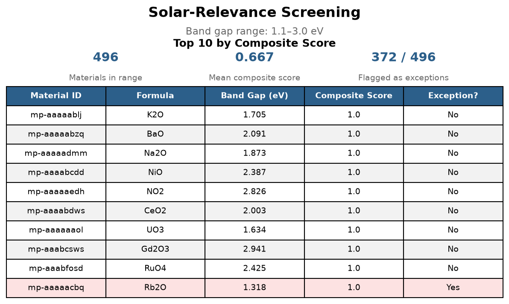

# 🔬 Oxide Symmetry, Stability & Solar Suitability

  
  
  
  

  <em>A data-driven look at whether crystal symmetry relates to how stable oxide materials are, built to demonstrate honest, careful analysis on a real dataset, not to claim a scientific discovery.</em>

---
## 📋 Table of Contents
1. [What This Project Is](#what-this-project-is)
2. [Repository Structure](#repository-structure)
3. [Symmetry vs. Stability, Where the Pattern Breaks](#symmetry-vs-stability-where-the-pattern-breaks)
4. [A Composite Stability–Symmetry Score](#a-composite-stabilitysymmetry-score)
5. [Polymorph Family Case Studies](#polymorph-family-case-studies)
6. [Solar-Relevance Screening](#solar-relevance-screening)
7. [Appendix: Standalone Data-Cleaning Practice](#appendix-standalone-data-cleaning-practice)
8. [A Few Honest Notes on What This Actually Shows](#a-few-honest-notes-on-what-this-actually-shows)
9. [Appreciation](#appreciation)

## What This Project Is

I wanted to actually test something instead of just reading about it: does a crystal being more symmetric usually mean it's more stable? That's the whole question this project is trying to answer, using real oxide data pulled from the Materials Project API.

`fetch_data.py` pulls everything straight from the Materials Project API and writes it to `oxides_raw.csv` which is the real, clean data every other script in this repo actually uses. I also wanted practice cleaning a genuinely messy dataset, so I took that clean CSV, injected fake noise into it on purpose (missing values, bad casing, duplicates, the works), and cleaned that separately as its own exercise. That messy/cleaned pair doesn't feed into any of the actual analysis below, it's just there because I wanted the practice.

---

## Repository Structure

| File | Role |
|---|---|
| `fetch_data.py` | Pulls raw oxide records from the Materials Project API |
| `data_utils.py` | Shared cleaning/utility functions used by every piece below |
| `symmetry_stability.py` | Symmetry-vs-stability exception detection & plotting |
| `composite_score.py` | Composite stability–symmetry scoring & ranking comparison |
| `polymorph_family.py` | Per-formula polymorph family case studies |
| `solar_filter.py` | Band-gap screening for solar relevance |
| `clean_data.py` / `inject_test_noise.py` | Standalone cleaning-practice exercise ([see appendix](#-appendix-standalone-data-cleaning-practice)) — not part of the main pipeline |
| `assets/` | Generated plots and report images |

>  **Note on `assets/`:** this folder contains **638 individual polymorph-family plots** (one per formula, generated by `polymorph_family.py` in `"everything"` mode) in addition to the main summary plots referenced below. They're included for anyone who wants to browse a specific formula, but they're not required reading(PLEASE DONT WASTE YOUR TIME) the summary plots embedded in this README tell the actual story. To get them yourself: `python polymorph_family.py` with `formula="everything"`.

---

## Symmetry vs. Stability, Where the Pattern Breaks

**File:** `symmetry_stability.py`

For every chemical formula in the dataset, this groups all of its known polymorphs together and checks: is the *most stable* polymorph of that formula also the *most symmetric* one? When it isn't, that's flagged as an **exception**.

### Finding

If a formula has only one polymorph then there are no exceptions. But as the number of polymorphs per formula increases, the exception rate climbs sharply, approaching 100% for formulas with many known polymorphs.

This is a statistical consequence of the question being asked. With only two polymorphs, there's roughly a coinflip chance the most-stable one and the most-symmetric one are the same row. With ten or twenty polymorphs, all of them would have to line up in the same order across two independent rankings (stability and symmetry) for no exception to occur and that gets rarer the more competitors there are.

So the honest reading isn't *"symmetry rarely predicts stability."* It's: **single-polymorph or low-polymorph-count formulas show a fairly consistent match between symmetry and stability, and the apparent breakdown at higher polymorph counts is largely an artifact of how many ways there are to not perfectly align once more candidates are in play.**

  

*Distribution of `energy_above_hull` at each symmetry rank (1 = Triclinic, 7 = Cubic), with the specific most-stable and most-symmetric material per formula marked. Y-axis is log-scaled since one outlier (~9.7 eV above hull) would otherwise flatten the rest of the distribution.(Thanks Ta11O2 for ruining my violin plot)*

> **Note:** this counts and describes exceptions found in the dataset. It does not explain *why* any individual exception occurs physically that would require me to know defect chemistry, phonon calculations, or other modeling that neither me nor this project want to attempt.

---

## A Composite Stability–Symmetry Score

**File:** `composite_score.py`

To see whether combining stability and symmetry into one number reveals anything a single variable alone doesn't, this normalizes both `energy_above_hull` (flipped values, so more stable -> closer to 1) and symmetry rank (using the fixed 1–7 theoretical range, not just whatever range happens to appear in the pulled data) to a 0–1 scale, then averages them into a single **composite score** per material.

### Finding

Comparing the top-10 materials by composite score, stability alone, and symmetry alone showed **almost no overlap** between the symmetry-based ranking and either of the other two — 0 shared materials with stability alone, 0 shared with the composite score. Composite score and stability alone overlapped on 4 of 10. (Should look at top 100 or 250 for any noticeable changes)

**Likely explanation:** symmetry rank only has 7 possible values, so "top-10 by symmetry" is really just 10 arbitrary picks among however many hundreds or thousands of materials share the maximum rank (Cubic) there's no way to distinguish further within that tie. `energy_above_hull`, by contrast, is continuous and close to unique per material, so its top-10 is a genuinely discriminating ranking. Comparing a near-arbitrary ranking against a highly discriminating one should be expected to produce low overlap, regardless of any real underlying relationship between symmetry and stability.

> **Note:** this composite score is an index defined for this project only, the composite score has no established physical meaning and shouldn't be mistaken for a recognized materials science metric. Given the resolution mismatch above, the "symmetry half" of this score is also considerably coarser than the "stability half," which limits how much weight the composite score's symmetry contribution can be read as meaningful. ok thanks

---

## Polymorph Family Case Studies

**File:** `polymorph_family.py`

The Above two files look at the *entire* dataset at once, reduced to aggregate statistics. This piece zooms into **one specific chemical formula's family of polymorphs** at a time and lays out the whole relationship in detail, not a single yes/no flag, but an actual side-by-side comparison of how stability moves as symmetry changes within that one family, plus simple descriptive stats on how tightly or loosely that stability is concentrated (`stability_spread()` with standard deviation, range, and mean of `energy_above_hull` across the family).

Each family's plot pairs the symmetry-vs-stability trend line with its summary table and stats baked directly into the same image, so every plot is self-contained.

  

*Example: the TiO2 polymorph family, showing energy_above_hull across its known symmetries, with the most stable polymorph starred.*

> **Note:** this is a descriptive, per-formula summary and it deliberately avoids collapsing "how spread out is stability" into a single invented score with an arbitrary cutoff for "tight" vs. "spread out." The raw numbers (std, range, mean) are reported as-is; judging what counts as tightly concentrated is left to the reader rather than baked into some random standard I hold.

---

## Solar-Relevance Screening

**File:** `solar_filter.py`

As a final, coarse screening pass, this filters the dataset for oxides whose `band_gap` falls within a commonly cited range for solar applications (~1.1–3.0 eV, covering both photovoltaic absorption and UV-active photocatalysis), then cross-references that subset against the composite scores and exception flags from the earlier pieces.

  

### Finding

496 materials fell within the 1.1–3.0 eV band gap range, with a mean composite score of 0.667 across that subset. 372 of those 496 (about 75%) belong to formulas already flagged as symmetry/stability exceptions in the first analysis which is consistent with the earlier finding that exceptions become increasingly common as more polymorphs enter the picture, since many oxide formulas in this band gap range have several known polymorphs.

> **Note:** this is a **rough screening proxy only**. Band gap here indicates "electronically in the right range" so it says nothing about photostability, degradation under illumination, device efficiency, or material lifetime, none of which this dataset measures.

---

## Appendix: Standalone Data-Cleaning Practice

`clean_data.py` and `inject_test_noise.py` are **not part of the main analysis pipeline** as described above. They're a self-contained exercise built to practice data cleaning on realistically messy data but I really wanted to keep them in the repo:

- `inject_test_noise.py` deliberately introduces messiness into a copy of the clean, already-pulled dataset: missing values, invalid negative band gaps, inconsistent text casing in crystal system names, and duplicate rows.
- `clean_data.py` cleans that manufactured mess back up: coercing numeric columns, masking invalid values, normalizing casing, and dropping remaining nulls.
---

## A Few Honest Notes on What This Actually Shows

None of this is a scientific discovery or useful data. Everything above only says what the actual numbers show, and I tried to flag it every time a result could sound bigger than it actually is or atleast tried my best.

A few things this project genuinely can't tell you: 
1. why any specific exception happens physically
2. whether any of these materials would actually hold up under real-world light exposure
3. how efficient a device made from them would be, or whether they'd survive being made in a lab at all.
4. Materials Project gives you computed, ground-state numbers, nothing about durability or performance, so that's all this can talk about.

If something above looked like it might be a bigger deal than it is, I said so right there 👍

## Appreciation
A very special thanks to (Win + .) for letting me use emojis in my readme LOL